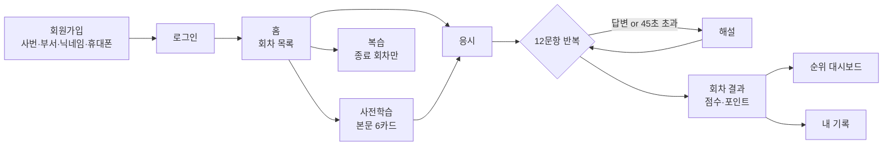

# HRDK 안전·청렴 ON! 골든벨


한국산업인력공단 전 직원(약 1,800명)을 대상으로 6주간 매주 안전 퀴즈를 제공하는 사내 웹 서비스입니다.
회차마다 12문항을 풀고, 순위와 포상으로 참여를 유도하면서 캠페인 전후의 안전 지식 향상도를 측정합니다.

한시 운영이 전제입니다. 두 달 뒤 데이터를 회수하고 프로젝트를 정리하는 것까지 범위에 들어 있어서,
기능을 넓히기보다 **정해진 규칙을 정확히 지키는 쪽**에 무게를 두고 만들었습니다.

## 어떻게 돌아가는가



| | |
|---|---|
| 회차 구성 | 6회차 × 12문항 = 72문항 |
| 문항 유형 | 4지선다 53 · O/X 14 · 순서배열 4 · 단답 1 (2026-08-25 청렴 개편) |
| 개방 시간 | 월 00:00 ~ 금 23:59 (KST) |
| 제한시간 | 문항당 45초, 초과 시 오답 확정 후 해설 |
| 응시 기회 | 1인 1회차 1회, 재응시·이어하기 없음 |
| 순위 | 주간 우수자(회차별) · 전체 우수자(평균 포인트) · 우수 부서(종합점수 = 평균 포인트 50% + 참여율 50%) — 포상 3종과 1:1 |

성과측정은 사전·사후 9쌍(2026-08-25 청렴 개편으로 12쌍에서 조정)으로 설계했습니다.
1~2회차에서 지식을 묻고, 5~6회차에서 같은 지식을 상황 판단으로 다시 묻는 구조입니다.
쌍을 모두 확정한 참가자만 KPI 표본에 넣기 때문에, 참가자가 측정 문항을 알아채면 지표가 조용히 오염됩니다.
그래서 응답 페이로드에서 `measureCode`·`anchorCode`·`level`을 **단계와 무관하게 영구 제외**합니다.

## 기술 스택

| 영역 | 선택 |
|---|---|
| 프레임워크 | Next.js 15 (App Router), TypeScript |
| 스타일 | Tailwind CSS v4 |
| DB | Supabase (PostgreSQL) |
| 인증 | 자체 구현 — bcrypt + httpOnly 서명 쿠키 |
| 배포 | Vercel (서울 리전, Cron 2건) |
| 패키지 매니저 | pnpm 10 |

브라우저에서 Supabase를 직접 호출하지 않습니다. 모든 DB 접근은 Route Handler에서 service role 키로만 이뤄지고,
그래서 RLS 정책도 쓰지 않습니다. `NEXT_PUBLIC_SUPABASE_*` 환경변수는 존재하지 않습니다.

## 설계에서 특히 신경 쓴 것

퀴즈 서비스는 규칙이 조금만 어긋나도 순위 전체가 무의미해집니다. 아래 다섯 가지가 그 경계입니다.

**타이머는 서버가 판정합니다.** 클라이언트가 보낸 경과시간을 믿지 않고 `served_at`과 서버 `now()`의 차이로만
계산합니다. `served_at`은 문항을 처음 서빙할 때 한 번만 기록하므로, 새로고침으로 시간을 늘릴 수 없습니다.
화면의 카운트다운은 표시용입니다.

**정답은 답변 전에만 숨깁니다.** 판정 기준은 클라이언트가 보낸 단계 값이 아니라 서버의 `answered_at`입니다.
이미 답한 문항은 사용자가 정답을 알고 있으니, 해설 화면을 새로고침하면 해설을 다시 보여줘야 합니다.

**선택지 셔플은 세션 생성 시 한 번만** 수행하고 `choice_order`에 저장합니다. 제출값은 화면상 위치이고,
채점은 저장된 순열로 원본 인덱스를 되돌려 비교하며, DB에는 원본 인덱스를 남깁니다. 요청마다 다시 섞으면
정답 판정이 어긋나고 사후 분석도 불가능해집니다.

**포인트는 저장하지 않고 파생합니다.** `is_correct`와 `elapsed_ms`에서 SQL 뷰와 TypeScript가 같은 식으로
계산합니다(정답 100점 + 남은 시간 비례 보너스 최대 100점). 두 구현이 어긋나면 결과 화면과 순위가 갈라지므로
단위 테스트로 묶어 뒀습니다.

**운영 파라미터는 하드코딩하지 않습니다.** 제한시간·세션 만료·최소 응시 회차·부서 최소 인원 등은
`app_config` 테이블에서 읽습니다.

## 시작하기

```bash
git clone https://github.com/kym-hrdkorea/esgsafety-goldenbell.git
cd esgsafety-goldenbell
pnpm install
# 아래 환경변수 안내대로 .env.local 을 만든 다음
pnpm typecheck && pnpm build   # 통과하면 환경변수가 맞다
pnpm dev                       # http://localhost:3000
```

`node_modules/` · `.next/` · `next-env.d.ts` · `tsconfig.tsbuildinfo`는 옮기지 않습니다.
`pnpm-lock.yaml`이 커밋돼 있어 `pnpm install`이 같은 버전으로 복원합니다.

### 환경변수 — `.env.local`

비밀값이라 저장소에 없습니다(`.gitignore`). **개발을 이어받을 때 실제로 옮겨야 하는 값은 Supabase 2개뿐입니다.**

| 키 | 필요성 | 어디서 얻나 |
|---|---|---|
| `SUPABASE_URL` | **필수 · 동일해야 함** | Supabase 대시보드 → Project Settings → Data API |
| `SUPABASE_SERVICE_ROLE_KEY` | **필수 · 동일해야 함** | 같은 화면의 `service_role` 키 (`anon` 아님) |
| `SESSION_SECRET` | 새로 만들어도 무해 | 아래 명령 |
| `CRON_SECRET` | 새로 만들어도 무해 | 아래 명령 |
| `ADMIN_LOGIN_ID` | 관리자 최초 시딩 때만 | 시딩 후 비워 둔다 |
| `ADMIN_INIT_PASSWORD` | 관리자 최초 시딩 때만 | 16자 이상, 성공 직후 비운다 |

```bash
node -e "console.log(require('crypto').randomBytes(32).toString('base64'))"
```

세션 시크릿을 새로 만들어도 되는 이유는 쿠키가 도메인별이라 `localhost`와 운영이 애초에 별개이고,
Cron 라우트는 자기 환경변수와만 대조하기 때문입니다. 덕분에 채널로 옮길 비밀값이 둘로 줄어듭니다.

service role 키는 RLS를 우회하는 전권 키입니다. **대시보드에서 직접 복사해 새로 작성하는 것이 가장 안전하고**,
차선은 사내 비밀번호 관리자입니다. 메신저·이메일·메모 앱으로 보내지 않습니다.

### 사내망 PC에서 걸리는 것 3가지

셋 다 코드 문제가 아니라 PC 환경 설정입니다. 증상만 보면 회귀로 오인하기 쉽습니다.

| 증상 | 원인 | 조치 |
|---|---|---|
| `pnpm` 명령이 전부 실패한다 | corepack이 pnpm 11을 받아오는데, 이 저장소는 pnpm 10 기준이다. pnpm 11은 `package.json`의 `pnpm.onlyBuiltDependencies`를 읽지 않는다 | `corepack prepare pnpm@10 --activate` |
| `pnpm test:prelearning`만 "JSON·SQL 본문 불일치"로 실패한다 | `core.autocrlf=true`면 체크아웃이 CRLF로 바뀌어, 검증기가 SQL 리터럴의 줄바꿈과 JSON의 `\n`을 비교하다 어긋난다 | `git config core.autocrlf false` 후 재체크아웃 |
| `/api/health`가 500, 로그에 `fetch failed` | 사내망 TLS 검사 프록시의 자체서명 인증서(`SELF_SIGNED_CERT_IN_CHAIN`). Node가 사내 루트 CA를 모른다 | 아래처럼 CA 번들을 지정해 기동한다. Vercel 운영에는 해당 없다 |

```powershell
$env:NODE_EXTRA_CA_CERTS='C:\certs\win-root-bundle.pem'; pnpm dev
```

터미널에서 직접 실행하면 사용자 환경변수 `NODE_EXTRA_CA_CERTS`가 자동으로 상속되므로 별도 지정이 필요 없습니다.

**네 번째 함정 — 휴대폰으로 LAN 접속 테스트 시 로그인이 안 되는 것처럼 보입니다.**
`pnpm start`(production)의 세션 쿠키에는 `Secure` 플래그가 붙는데, 브라우저는 `localhost`가 아닌
평문 HTTP 출처(`http://192.168.x.x:3000`)에서 Secure 쿠키 저장을 거부합니다. 로그인 API가 200을
반환해도 세션이 남지 않아 로그인 화면으로 되돌아옵니다. LAN 테스트 때만 아래처럼 실행하세요.

```powershell
$env:ALLOW_HTTP_COOKIE='1'; pnpm start -H 0.0.0.0
```

`ALLOW_HTTP_COOKIE`는 **Vercel에 절대 등록하지 않습니다** — 운영(HTTPS)은 항상 Secure 쿠키를 씁니다.

## 검증

```bash
pnpm typecheck        # 무출력 = 정상
pnpm test             # 채점 로직 단위 테스트
pnpm test:admin       # 관리자 CSV·KST 유틸
pnpm test:items       # 문항은행 (6×12·유형·난이도·측정쌍)
pnpm test:prelearning # 사전학습 본문 ↔ SQL 정합
pnpm test:outcomes    # 성과측정 산식·계약
pnpm test:sessions    # 세션 원자성·복구·만료
pnpm test:t20         # 순위·CSV·경계 UI 회귀
pnpm test:t22         # 운영 설정(리전·Cron·인증·KST)
pnpm build
```

`test:items`부터는 로컬 파일만 검사하므로 환경변수가 없어도 돌아갑니다.
실DB 계약을 확인하려면 `pnpm test:t21`(읽기 전용)을 씁니다.

## DB 구축

새 Supabase 프로젝트라면 SQL Editor에서 순서대로 실행합니다.

```
01_schema.sql → 02_seed_org.sql → 03_seed_rounds.sql → 04_seed_items.sql
→ 05_views.sql → 06_seed_prelearning.sql → 07_session_functions.sql
```

기존 프로젝트를 재구축할 때는 `db/t21-snapshot.mjs`로 백업·행 수를 확인한 뒤
`db/build-t21-migration.mjs`로 보호된 단일 트랜잭션을 만듭니다. 응시 데이터가 있으면 초기화하지 않습니다.

```sql
SELECT count(*) FROM org_unit;    -- 50
SELECT count(*) FROM department;  -- 193
SELECT count(*) FROM quiz_item;   -- 72
SELECT item_type, count(*) FROM quiz_item GROUP BY 1;
-- MC4 55 / OX 14 / ORDER 2 / SHORT 1
```

회차 일정(`opens_at`/`closes_at`)이 바뀌면 시드를 다시 돌리지 않고 **6행 절대값 UPDATE**로 조정하고,
`db/03_seed_rounds.sql`과 `db/verify-t21.mjs`의 기대 일정도 같은 값으로 함께 고칩니다.

## 운영 설정

- 함수 리전은 서울 `icn1`. 순위 갱신 Cron은 매분, 세션 만료는 5분 주기입니다.
- 두 Cron 라우트는 `maxDuration=60`이고 `CRON_SECRET` Bearer 인증이 없으면 401입니다.
- **매분 Cron은 Vercel Pro 이상이 필요합니다.** Hobby에서는 이 일정으로 배포가 실패합니다.
- Production에는 서버 전용 비밀값 4개(`SUPABASE_URL`, `SUPABASE_SERVICE_ROLE_KEY`, `SESSION_SECRET`, `CRON_SECRET`)만 둡니다.
- Vercel은 `TZ`를 예약 환경변수로 거부합니다. 회차 시각은 `+09`로 저장하고 화면·CSV에서 `Asia/Seoul`을 명시하므로 `TZ`에 의존하지 않습니다.
- 환경변수 변경은 기존 배포에 소급되지 않습니다. 새 Production 배포 후 `/api/health`와 Cron을 반드시 확인합니다.
- 회차 공개(`is_published`) 전환 버튼은 의도적으로 만들지 않았습니다. 개시 시점에 SQL로 1회 전환합니다.

## 현재 상태

| 항목 | 상태 |
|---|---|
| 구현 | T00~T22 완료. 실DB에 6회차·72문항·뷰 16개·세션 RPC 3개 적용 |
| 검증 | 타입검사·단위 테스트 33개·검증기 6종·프로덕션 빌드 통과 |
| 운영 일정 | **미정.** 기존 시드값(2026-08-17 개시)은 경과했으므로 확정 후 재설정 필요 |
| 남은 일 | 100 VU 부하 테스트 증적, 파일럿 5~10명, 문항 주제 확대 검토 |

문항은 현재 전부 안전 주제입니다. 안전 비중을 40%대로 유지하면서 **청렴·적극행정을 추가하는 개편**을 검토 중이며,
후보 문항과 법령 검증 근거는 `tasks/후보문항-*.md`에 있습니다.

### 개시 전 체크리스트

- [x] 회차 일정 반영, `is_published` 전환 절차 확정
- [x] 사전학습 본문 6건 작성 및 적용
- [x] Supabase 6회차·72문항·뷰·RPC 적용 및 실DB 검증
- [x] 법령 시점 재확인 (2-04, 2-08, 4-09, 6-03, 6-07, 6-11)
- [x] 관리자 계정 1회 시딩 후 초기 환경변수 삭제
- [x] Vercel Cron 2건 등록
- [ ] A2 앵커 6문항을 실제 안전신문고 화면·절차와 대조 검수
- [ ] 파일럿 응시 5~10명, 회차 평균 정답률 70~75% 확인
- [ ] 매주 금요일 응답 CSV 백업 절차 확정
- [ ] 포상 인원·금액 확정

## 문서

작업을 이어받는다면 이 순서로 읽는 편이 빠릅니다.

| 문서 | 내용 |
|---|---|
| [`tasks/continuation-plan.md`](tasks/continuation-plan.md) | **현재 기준 단일 진입점.** 카드 순서와 완료 조건 |
| [`spec/business-rules.md`](spec/business-rules.md) | 채점·타이머·순위 규칙. 버그의 대부분이 여기서 나온다 |
| [`spec/decisions-addendum.md`](spec/decisions-addendum.md) | 확정 결정 A~P. 다른 문서에 없는 판단 근거가 여기 있다 |
| [`spec/api-contract.md`](spec/api-contract.md) | API 계약과 금지 필드 |
| [`spec/functional-spec.md`](spec/functional-spec.md) | 기능 범위와 **만들지 않는 것** |
| [`db/01_schema.sql`](db/01_schema.sql) | 스키마 (12개 테이블) |
| [`design/copy.md`](design/copy.md) | 화면 문안 확정본. 모든 UI 텍스트의 유일 출처 |
| [`decisions.md`](decisions.md) | 의사결정 24건과 정정 이력 |
| [`CLAUDE.md`](CLAUDE.md) | 절대 규칙 10개. 위반하면 재작업 |

`tasks/ux-findings.md`와 `tasks/code-review-findings.md`는 8회차 시절의 감사 기록입니다.
6회차 개편으로 대체된 판단이 섞여 있어 이력으로만 봅니다.

## 디렉터리

```
app/
  (auth)/         로그인 · 회원가입 · 비밀번호 재설정
  (main)/         홈 · 사전학습 · 응시 · 결과 · 복습 · 순위 · 내 기록
  admin/          관리자 조회 (읽기 전용 + CSV)
  api/**/route.ts 모든 서버 로직
lib/
  db.ts           Supabase 서버 클라이언트 (service role)
  session.ts      HMAC 서명 쿠키 세션
  config.ts       app_config 로더 (60초 캐시)
  grading.ts      유형별 채점 — 단위 테스트 대상
  shuffle.ts      시드 기반 셔플
  quiz.ts         세션 수명주기 · 개방 판정
  admin.ts        페이지네이션 · CSV · KST 포맷
components/
  quiz/           OxItem · Mc4Item · OrderItem · ShortItem · Timer · Explanation
  dashboard/      RankTable (5행 + 더보기)
db/               스키마 · 시드 · 뷰 · 세션 함수 · 검증 스크립트
spec/             명세 5종 + 법령 근거
design/           문안 · 화면 · 토큰 · 목업 11종
tasks/            작업 카드 · 계획 · 감사 기록 · 문항 후보
```
